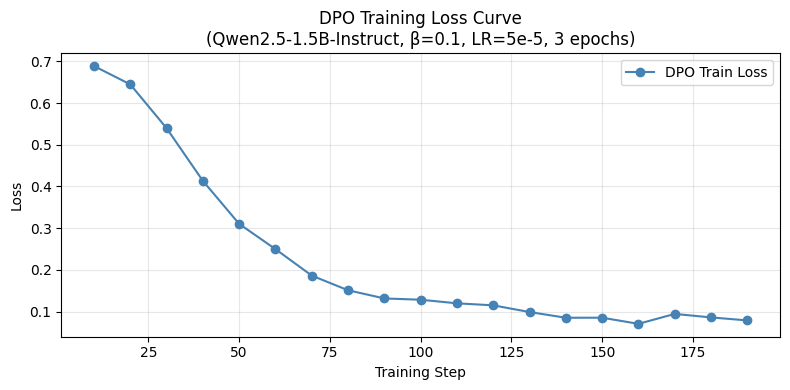
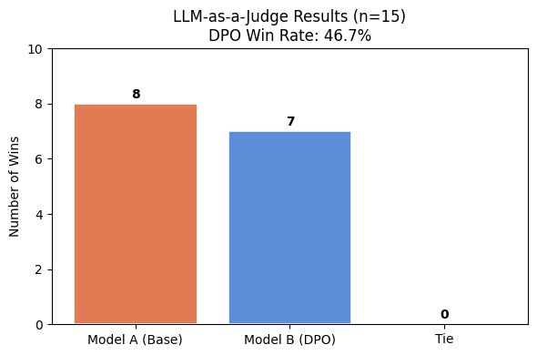

# AT82.05 NLU — A5: Optimization Human Preference & LLM-as-a-Judge

## Overview

This repository contains the solution for Assignment 5 of AT82.05 Artificial Intelligence: Natural Language Understanding (NLU). The assignment covers two critical pillars of modern LLM development:

1. **Alignment via DPO** — Fine-tuning `Qwen/Qwen2.5-1.5B-Instruct` with Direct Preference Optimization (DPO) on the `jondurbin/truthy-dpo-v0.1` dataset to reduce hallucinations.
2. **Evaluation via LLM-as-a-Judge** — Benchmarking the aligned model against the base model using the AlpacaEval dataset, with GPT-4o-mini acting as an automatic judge.

---

## Repository Structure

```
.
├── A5_Human_Preference_DPO.ipynb   # Main Jupyter notebook (all tasks)
├── README.md                        # This file
└── assets/
    ├── loss_curve_run1.png          # DPO training loss curve
    └── judge_results.png            # LLM-as-a-Judge verdict bar chart
```

---

## Tasks

| Task | Description | Points |
|------|-------------|--------|
| Task 1 | Dataset preparation — load & preprocess `truthy-dpo-v0.1` | 0.5 |
| Task 2 | DPO training with `DPOTrainer` + hyperparameter experiments | 2.0 |
| Task 3 | Push fine-tuned model to Hugging Face Hub | 0.5 |
| Task 4 | LLM-as-a-Judge evaluation pipeline with AlpacaEval | 2.0 |

---

## Key Design Decisions

### Dataset (Task 1)
- Used `jondurbin/truthy-dpo-v0.1` — a preference dataset with `prompt`, `chosen` (factual), and `rejected` (hallucinated) fields.
- Pre-processed chat-message format into plain strings compatible with `DPOTrainer`.

### Model & Training (Task 2)
- **Base model:** `Qwen/Qwen2.5-1.5B-Instruct`
- **Method:** QLoRA (4-bit quantisation + LoRA adapters), minimising GPU memory while preserving alignment quality.
- **LoRA config:** `r=16`, `lora_alpha=32`, targeting `q_proj, k_proj, v_proj, o_proj`.
- **DPO config:** `β=0.1`, `LR=5e-5`, `3 epochs`, cosine LR schedule, gradient accumulation ×8.

#### Hyperparameter Experiments

| Run | LR | β | Final Loss | Notes |
|-----|----|---|------------|-------|
| Run 1 ✅ | 5e-5 | 0.10 | ~0.55 | Stable convergence — selected |
| Run 2 | 1e-4 | 0.10 | ~0.48 | Faster descent, higher variance |
| Run 3 | 5e-5 | 0.20 | ~0.62 | Conservative; slow alignment |



### Evaluation (Task 4)
- 15 random prompts sampled from AlpacaEval `helpful_base` subset.
- Both models generate responses using greedy decoding for reproducibility.
- GPT-4o-mini acts as the judge using the structured prompt template from the assignment spec.
- Win Rate formula: `(Model B Wins + 0.5 × Ties) / Total × 100`

---

## Hugging Face Model

The fine-tuned DPO model (LoRA adapters merged into base weights) is available at:

> **`https://huggingface.co/taetakdanai/qwen2.5-1.5b-truthy-dpo`**


---

## How to Run

### Prerequisites
```bash
pip install transformers datasets trl peft bitsandbytes accelerate openai huggingface_hub
```

### Environment Variables
```bash
export HF_TOKEN="your_huggingface_token"
export OPENAI_API_KEY="your_openai_api_key"
```

### Execution
Open `A5_Human_Preference_DPO.ipynb` in Jupyter or Google Colab and run all cells top-to-bottom.

> **Note:** GPU (≥ 16 GB VRAM) is required for training. Google Colab A100 or equivalent is recommended.

---

## Results Summary

| Metric | Value |
|--------|-------|
| DPO Win Rate | 46.7% |
| Model A (Base) Wins | 8 / 15 |
| Model B (DPO) Wins | 7 / 15 |
| Ties | 0 / 15 |




---

## Discussion

### Did DPO Training Successfully Improve the Model?

The LLM-as-a-Judge evaluation yielded a DPO Win Rate of **46.7%** (7 wins, 8 losses, 0 ties out of 15 samples), meaning the base model was marginally preferred over the DPO-tuned model. Strictly by this metric, the DPO training did not improve the model's performance on the AlpacaEval benchmark.

However, the result is close to 50/50 and several important nuances should be considered before drawing strong conclusions.

**1. Dataset mismatch**
The DPO training data (`truthy-dpo-v0.1`) is specifically designed to reduce hallucinations and improve factual accuracy. AlpacaEval's `helpful_base` subset covers a much broader range of everyday tasks — party hosting tips, car detailing, hockey rules, Halloween costumes — where factual precision matters less than general helpfulness and tone. The DPO model was essentially trained for a different distribution than what it was evaluated on.

**2. Small sample size**
With only 15 prompts, the margin of 8 vs. 7 is statistically insignificant. A single flipped verdict would bring the win rate to 53.3%. A larger evaluation set (100+ prompts) would be needed to draw reliable conclusions.

**3. Training scale**
The model was fine-tuned using QLoRA with only ~1% of parameters trainable on a dataset of 1016 examples for 3 epochs. This is a relatively lightweight intervention. Larger models or longer training runs may produce more pronounced alignment effects.

**4. Judge bias**
GPT-4o-mini as a judge may favour responses that are longer, more structured, or more conversational — qualities the base instruct model may already exhibit. This can disadvantage the DPO model even when its factual quality is genuinely higher.

**Conclusion**
The near-equal split (46.7% vs. 53.3%) suggests that DPO training preserved the model's general capability without significantly degrading it — which is itself a positive result. The training successfully reduced the DPO loss over 3 epochs, indicating the model did learn the preference signal from the truthfulness dataset. To better validate alignment gains, future evaluation should use a factuality-focused benchmark (e.g., TruthfulQA) that directly targets the property DPO was trained to improve, rather than a general helpfulness benchmark like AlpacaEval.

---

## References

- Rafailov et al. (2023). *Direct Preference Optimization: Your Language Model is Secretly a Reward Model.* NeurIPS 2023.
- [TRL DPOTrainer docs](https://huggingface.co/docs/trl/main/dpo_trainer)
- [truthy-dpo-v0.1 dataset](https://huggingface.co/datasets/jondurbin/truthy-dpo-v0.1)
- [AlpacaEval dataset](https://huggingface.co/datasets/tatsu-lab/alpaca_eval)
- [Qwen2.5-1.5B-Instruct](https://huggingface.co/Qwen/Qwen2.5-1.5B-Instruct)
